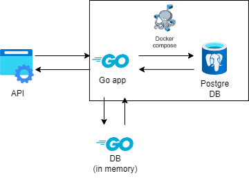

# comment-system
Система для добавления и чтения постов и комментариев аналогичная Reddit или Хабр

## Запуск

Локально (используется in memory)
```
make run
```

Docker (используется PostgreSQL)
```
make docker
```
## Схемы запросов

```(GrphQL)
type Query {
  posts(limit: Int = 25, offset: Int = 0): [Post!]!
  post(id: Int!): Post!
  comments(postId: Int!, limit: Int = 25, offset: Int = 0): [Comment!]!
  repliesToComment(commentId: Int!, limit: Int = 25, offset: Int = 0): [Comment!]!
}

type Mutation {
  createPost(input: NewPost!): Post!
  createComment(input: NewComment!): Comment!
  updatePostPermission(input: updatePostPermission!): Post!
}

type Subscription {
  listenComments(postId: Int!): Comment!
}
```

## Архитектура


* Docker - для контейнеризации сервиса
* PostgreSQL - в роли БД
* Docker compose - для управления несколькими контейнерами

Существует два режима:

* In-memory: БД хранится в памяти приложения
* Postgres: БД хранится в отдельном контейнере

## Пример запросов
Здесь только часть, лучше создавать используя схему

####  Создание поста
```
curl -X POST http://localhost:8080/query \
-H "Content-Type: application/json" \
-d '{
  "query": "mutation CreatePost($input: NewPost!) { createPost(input: $input) { id, name, text } }",
  "variables": {
    "input": {
      "userId": 1,
      "commentsEnabled": true,
      "name": "New Post",
      "text": "Hello, world!"
    }
  }
}'
```
Ответ:
```
{"data":{"createPost":{"id":1,"name":"New Post","text":"Hello, world!"}}}
```

####  Получение постов
```
curl -X POST http://localhost:8080/query \
-H "Content-Type: application/json" \
-d '{
  "query": "query GetPosts($limit: Int = 25, $offset: Int = 0) { posts(limit: $limit, offset: $offset) { id, name, text } }",
  "variables": {
    "limit": 10,
    "offset": 0
  }
}'
```
Ответ:
```
{"data":{"posts":[{"id":1,"name":"New Post","text":"Hello, world!"}]}}
```

####  Новый комментарий
```
curl -X POST http://localhost:8080/query \
-H "Content-Type: application/json" \
-d '{
  "query": "mutation CreateComment($input: NewComment!) { createComment(input: $input) { id, text } }",
  "variables": {
    "input": {
      "parentId": null,
      "userId": 1,
      "postId": 1,
      "text": "Great post!"
    }
  }
}'
```
Ответ:
```
{"data":{"createComment":{"id":1,"text":"Great post!"}}}
```

####  Комментарии к посту
```
curl -X POST http://localhost:8080/query \
-H "Content-Type: application/json" \
-d '{
  "query": "query GetCommentsForPost($postId: Int!, $limit: Int = 25, $offset: Int = 0) { comments(postId: $postId, limit: $limit, offset: $offset) { id, text } }",
  "variables": {
    "postId": 1,
    "limit": 5,
    "offset": 0
  }
}'
```
Ответ:
```
{"data":{"comments":[{"id":1,"text":"Great post!"},{"id":2,"text":"Great post!"},{"id":3,"text":"Great post!"}]}}
```